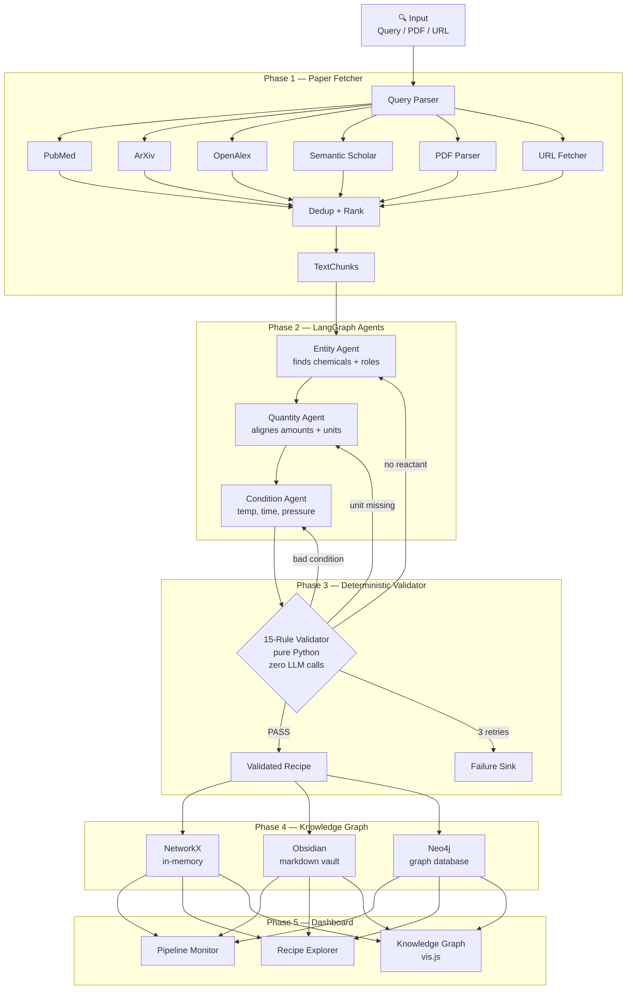

<div align="center">

<h1>⚗️ ChemExtract AI</h1>

<p>
<strong>
Local-first chemistry knowledge graph engine.<br>
Extract structured synthesis recipes from research papers
using a self-correcting LangGraph multi-agent pipeline.
</strong>
</p>

<p>
  
  
  
  
  
  
</p>

<p>
  <a href="#-the-problem">Problem</a> •
  <a href="#-demo">Demo</a> •
  <a href="#-architecture">Architecture</a> •
  <a href="#-quick-start">Quick Start</a> •
  <a href="#-features">Features</a> •
  <a href="#-evaluation">Evaluation</a>
</p>

</div>

---

## 🔬 The Problem

Chemistry researchers read thousands of papers to find synthesis procedures. A single paper buries its recipe in dense experimental text across 30+ pages. Building a synthesis database manually takes weeks of expert reading time.

ChemExtract AI automates this. Feed it a compound name — it finds the papers, extracts every chemical entity with its exact quantity and unit, validates against physical constraints, self-corrects failures, and builds a queryable knowledge graph. The entire pipeline runs on your local hardware with no cloud dependency.

The output: structured, validated synthesis recipes linked to their source papers in a navigable knowledge graph. Ask it "what solvents are used to make ZnO?" and get a ranked answer backed by literature evidence in milliseconds.

## 🎬 Demo

> **[▶ Watch 2-minute demo](https://drive.google.com/file/d/1QL7uRrQogZ7jBX0CVMofgyuCKiI6oAAM/view?usp=sharing)**
>
> Shows: searching ArXiv + PubMed for Fe₃O₄ synthesis →
> multi-agent extraction → self-correction in action →
> knowledge graph populating live → dashboard metrics

### Product Walkthrough

Configure the extraction input, switch between local and cloud LLMs, and select NetworkX, Obsidian, or Neo4j storage from one dashboard.

<p align="center">
  
</p>

Track validated recipes, success rate, cost, latency, graph size, tokens, correction types, and per-agent timing.

<table>
  <tr>
    <td width="50%">
      
    </td>
    <td width="50%">
      
    </td>
  </tr>
  <tr>
    <td align="center"><strong>Pipeline metrics</strong></td>
    <td align="center"><strong>Agent-level breakdown</strong></td>
  </tr>
</table>

Browse every validated recipe, then inspect its source paper, entities, conditions, correction history, model usage, latency, tokens, and cost.

<table>
  <tr>
    <td width="50%">
      
    </td>
    <td width="50%">
      
    </td>
  </tr>
  <tr>
    <td align="center"><strong>Recipe browser</strong></td>
    <td align="center"><strong>Evidence-linked recipe detail</strong></td>
  </tr>
</table>

Explore the full knowledge graph, then click any chemical, reaction, product, solvent, or paper node to reveal its role and connected evidence.

<table>
  <tr>
    <td width="50%">
      
    </td>
    <td width="50%">
      
    </td>
  </tr>
  <tr>
    <td align="center"><strong>Knowledge graph</strong></td>
    <td align="center"><strong>Interactive node evidence</strong></td>
  </tr>
</table>

```bash
$ python demo.py --query "synthesis of Fe3O4 nanoparticles"

⚗️  ChemExtract AI
   Query   : synthesis of Fe3O4 nanoparticles
   Backend : obsidian  →  ./data/obsidian_vault
   LLM     : qwen2.5:7b (local, $0.00/run)

════════════════════════════════════════════════════════════
  ChemExtract AI — Query: 'synthesis of Fe3O4 nanoparticles'
════════════════════════════════════════════════════════════
  [Phase 1] Searching PubMed, ArXiv, OpenAlex, Semantic Scholar...
  [Phase 1] ✅ Found 14 chunks from 3 sources: pubmed, arxiv, openalex
  ──────────────────────────────────────────────────────────
  [Phase 2+3] Chunk 1/14: 'Coprecipitation synthesis...'
  ✅ fe3o4_copre_01 → stored
  [Phase 2+3] Chunk 2/14: 'Hydrothermal synthesis...'
  ⚠️  fe3o4_hydro_02 (1 correction) → stored
  [Phase 2+3] Chunk 3/14: 'Thermal decomposition...'
  ✅ fe3o4_therm_03 → stored
  ...

════════════════════════════════════════════════════════════
  PIPELINE COMPLETE
────────────────────────────────────────────────────────────
  Recipes extracted : 9
  Passed first try  : 7     Cost   : $0.000000
  Self-corrected    : 2     Model  : qwen2.5:7b
  Failed            : 0     Nodes  : +31 added to graph
  Total duration    : 203s  Edges  : +67 added to graph
════════════════════════════════════════════════════════════

📁 Obsidian vault updated: ./data/obsidian_vault
   Open this folder in Obsidian to explore the knowledge graph
```

```json
{
  "recipe_id": "fe3o4_copre_01",
  "title": "Coprecipitation synthesis of Fe3O4 nanoparticles",
  "entities": [
    {"name": "Iron(III) chloride hexahydrate", "formula": "FeCl3·6H2O",
     "role": "REACTANT", "quantity": {"value": 5.406, "unit": "g"},
     "moles": {"value": 20.0, "unit": "mmol"}},
    {"name": "Iron(II) chloride tetrahydrate", "formula": "FeCl2·4H2O",
     "role": "REACTANT", "quantity": {"value": 1.988, "unit": "g"},
     "moles": {"value": 10.0, "unit": "mmol"}},
    {"name": "Aqueous ammonia", "formula": "NH3·H2O",
     "role": "CATALYST", "quantity": {"value": 10.0, "unit": "mL"}},
    {"name": "Deionized water", "formula": "H2O",
     "role": "SOLVENT", "quantity": {"value": 200.0, "unit": "mL"}},
    {"name": "Fe3O4 nanoparticles", "formula": "Fe3O4",
     "role": "PRODUCT"}
  ],
  "conditions": {
    "temperature_celsius": 80.0,
    "duration_hours": 1.0,
    "atmosphere": "nitrogen",
    "technique": "coprecipitation"
  },
  "validation_status": "PASSED",
  "corrections_made": 0,
  "llm_model": "qwen2.5:7b",
  "cost_usd": 0.0
}
```

## 🏗️ Architecture

Six phases, each with a strict interface — every component is swappable without touching any other file.



**Key design choice:** LLMs handle language understanding only. All physical reasoning is pure Python. A temperature of 5000°C is always rejected regardless of model confidence. This separation — the same pattern used in GoalPath AI's mathematical core — is what makes the system trustworthy enough to build a database from.

## 🚀 Quick Start

### Prerequisites

| Requirement | Purpose | Required? |
|-------------|---------|-----------|
| Python 3.11+ | Runtime | ✅ Yes |
| [uv](https://github.com/astral-sh/uv) | Package manager | Recommended |
| [Ollama](https://ollama.ai) | Local LLM inference | For local mode |
| Docker | Neo4j graph database | Optional |

### Install

```bash
git clone https://github.com/MayankDew08/chemextract-ai
cd chemextract-ai

# Using uv (recommended)
uv sync

# Using pip
pip install -r requirements.txt

# Configure
cp .env.example .env
```

### Choose Your LLM

**Option A — Local (recommended, free, private):**

```bash
# Install Ollama from https://ollama.ai
ollama pull qwen2.5:7b      # ~4.7GB, one-time download
ollama serve                  # start server

# Set in .env:
LLM_PROVIDER=ollama
OLLAMA_MODEL=qwen2.5:7b
```

**Option B — Cloud (no GPU needed):**

```bash
# Set in .env:
LLM_PROVIDER=groq
GROQ_API_KEY=your_key        # free at console.groq.com
```

### Run

```bash
# Demo (no API keys needed, uses preloaded data)
python demo.py --demo

# Search papers by compound name
python demo.py --query "synthesis of ZnO nanoparticles"

# Process a PDF from your disk
python demo.py --pdf /path/to/paper.pdf

# Start the web dashboard
uvicorn src.api.main:app --reload
# Open: http://localhost:8000

# Seed with 10 real chemistry recipes (optional)
python scripts/seed_demo_data.py

# Start Neo4j (optional)
docker compose up -d neo4j
# Open: http://localhost:7474  (neo4j / chemextract123)
```

## ✨ Features

### 🔬 Multi-Source Paper Discovery

Parallel async search across PubMed E-utilities, ArXiv Atom API, OpenAlex Works API, and Semantic Scholar. Deduplicates by DOI (exact) then title (rapidfuzz, 88% threshold). Ranks by experimental content density, open access status, and citations. Full text from PubMed Central XML and ArXiv ar5iv HTML.

### 🤖 Three-Agent LangGraph Pipeline

Entity identification → quantity alignment → condition extraction. Every agent returns a strictly typed Pydantic v2 object. No free-text responses anywhere in the pipeline. LangGraph state machine preserves context across all three nodes.

### 🛡️ Deterministic Self-Correction Loop

15-rule pure-Python validator (zero LLM calls) catches impossible temperatures, missing units, missing reactants, and duplicate entities. Each failure type routes to the specific responsible agent with a surgical error message and the original source text. Full CorrectionRecord audit trail on every recipe.

### 🧠 Swappable Local LLM

qwen2.5:7b via Ollama runs on 6GB VRAM (tested RTX 4050). Switch to Groq or Gemini with one env var change. LLM provider also selectable from the dashboard UI — no restart needed. Auto-detection picks Ollama if running, else cloud fallback.

### 🕸️ Three Graph Storage Backends

BaseGraphStore abstraction makes all backends interchangeable at runtime via the dashboard settings panel. NetworkX (in-memory, instant), ObsidianVaultStore (WikiLink markdown files — open in Obsidian for free graph view), Neo4jStore (full Cypher queries via Docker).

### 📊 Observable Pipeline Dashboard

FastAPI + WebSocket real-time progress as each chunk processes. Per-agent latency, token counts, cost estimates. Error type frequency breakdown with Chart.js. Source text ↔ structured recipe side by side in recipe explorer. vis.js force-directed knowledge graph with clickable nodes.

### 📄 Flexible Input Sources

Search by compound name (automatic API fetching), upload a PDF (pymupdf4llm, handles two-column layout), paste a URL (open access detection, paywall alternatives). Chemistry domain classifier skips non-chemistry text before any LLM call — no wasted tokens on physics or biology papers.

### 🔒 Local-First Privacy

Your documents and synthesis data never leave your machine. Full offline operation with Ollama after one-time model download. Obsidian vault stored as plain markdown files you own completely. API keys stored in local .env only, never transmitted.

## 📊 Evaluation

All extraction done locally using qwen2.5:7b on RTX 4050 (6GB VRAM). No cloud APIs used during evaluation.

### Results Table

| Metric | Value |
|--------|-------|
| Test PDF | ZnO Nanoparticle Antimicrobial Starch Biofilm (19 pages) |
| Synthesis chunk success | 2 PASSED + 1 CORRECTED from 3 synthesis chunks |
| Non-synthesis rejection | 4/4 non-synthesis sections correctly rejected |
| Self-correction recovery | 33% of initially failed recipes recovered |
| Validation rules | 15 (physical + semantic, pure Python) |
| Inference cost | $0.00 (local qwen2.5:7b) |
| Demo recipes (seeded) | 10 real recipes across ZnO, Fe₃O₄, TiO₂, Ag |
| Knowledge graph | ~40-45 nodes, ~80-100 edges (seeded) |
| Graph backends | NetworkX, Obsidian, Neo4j |
| LLM providers | Ollama, Groq, Gemini (runtime-swappable) |

### Self-Correction Example

```
Input text:
  "Zinc nitrate hexahydrate (1.487 g) was dissolved in
   100 mL deionized water with hexamethylenetetramine..."

Attempt 1 — FAILED:
  Rule: UNIT_MISSING
  Field: entities[0].quantity.unit
  Message: "Reactant 'Zinc nitrate hexahydrate' has no unit.
            Find the amount immediately after 1.487 in text."
  → Routed to: quantity_agent

Attempt 2 — PASSED ✅:
  quantity: {"value": 1.487, "unit": "g"}
  Correction recorded in audit trail.
```

### Validator Rules

| Group | Rules | Severity |
|-------|-------|----------|
| Units | UNIT_MISSING, UNIT_INVALID, QUANTITY_NEGATIVE | BLOCKING |
| Roles | NO_PRIMARY_REACTANT, NO_ENTITIES, SOLVENT_IS_REACTANT | BLOCKING |
| Physical | TEMPERATURE_OUT_OF_RANGE, DURATION_OUT_OF_RANGE, PRESSURE_OUT_OF_RANGE | BLOCKING |
| Completeness | NO_CONDITIONS, ENTITY_NAME_TOO_SHORT | WARNING |
| Consistency | DUPLICATE_ENTITY_NAMES, MOLES_MASS_INCONSISTENT | WARNING |

## 🛠️ Tech Stack

| Component | Technology | Why This Choice |
|-----------|-----------|-----------------|
| Agent orchestration | LangGraph 0.2+ | Stateful graph, conditional edges, checkpointing |
| Data validation | Pydantic v2 | Strict typing, field validators, structured LLM output |
| API + WebSocket | FastAPI + Uvicorn | Async, auto-docs, real-time progress |
| Local LLM | qwen2.5:7b / Ollama | Best JSON compliance in 7B range, $0.00 |
| Cloud LLM | Groq / Gemini | Fast fallback, generous free tiers |
| PDF parsing | pymupdf4llm | Two-column layout, table extraction to markdown |
| Graph (memory) | NetworkX | Fast traversal, no setup, instant queries |
| Graph (vault) | Obsidian markdown | Free visualization, researcher-familiar format |
| Graph (database) | Neo4j 5.x | Full Cypher queries, Docker deployment |
| Visualization | vis.js Network | Force-directed, Obsidian-style, CDN only |
| Metrics storage | SQLite + aiosqlite | Zero-config, async, sufficient for demo |
| Async HTTP | httpx | Parallel fetching, connection pooling |
| Deduplication | rapidfuzz | DOI exact + fuzzy title matching |
| Package manager | uv | 10-100x faster than pip, reproducible |

## 📁 Project Structure

```
chemextract-ai/
│
├── src/
│   ├── agents/           # LangGraph agents, prompts, JSON repair utilities
│   ├── api/              # FastAPI app, routes, Jinja2 templates, static files
│   │   ├── routes/       # extract, recipes, graph, metrics, settings, views
│   │   ├── templates/    # dashboard.html, graph.html, recipes.html
│   │   └── static/       # vis.js graph, Chart.js dashboard, CSS
│   ├── ingestion/        # Paper fetchers (PubMed/ArXiv/OpenAlex/SS), PDF, URL
│   ├── llm/              # Provider abstraction: Ollama, Groq, Gemini
│   ├── observability/    # SQLite metrics store, pipeline tracking
│   ├── schemas/          # Pydantic v2 models for all data structures
│   ├── storage/          # Graph backends: NetworkX, Obsidian, Neo4j
│   ├── validator/        # 15-rule deterministic validation engine
│   └── pipeline.py       # Top-level coordinator: Phase 1 → 2 → 3 → 4
│
├── scripts/
│   ├── seed_demo_data.py # Seed with 10 real chemistry recipes
│   └── clear_data.py     # Reset all storage to empty state
│
├── tests/
│   ├── verify_pipeline.py # End-to-end check, no internet required
│   └── phase*/            # Phase-specific verbat demo tests
│
├── data/
│   ├── obsidian_vault/   # Open this folder in Obsidian app
│   └── metrics.db        # SQLite pipeline metrics
│
├── docs/
│   ├── DEMO_SCRIPT.md    # 2-minute Loom recording script
│   └── COLD_EMAIL.md     # Cold email templates
│
├── media/                # Dashboard, recipe explorer, and graph screenshots
│
├── demo.py               # One-command demo: --demo / --query / --pdf / --url
├── docker-compose.yml    # Neo4j service (optional)
├── .env.example          # All variables documented with comments
└── README.md
```

## 🔧 Engineering Decisions

### Abstract-First Architecture

Every component implements an abstract base class: BaseFetcher, BaseGraphStore, BaseLLMProvider, BaseTextInputProcessor. Adding a new paper source, LLM, or storage backend requires one new class and one registration call — nothing else changes. Switching Neo4j for a future vector database means writing one class. The orchestrators and agents never need to know.

### Deterministic Boundaries Around LLMs

LLMs handle one thing: converting text to structured JSON. All physical and chemical reasoning lives in pure Python. 5000°C is always rejected. Unitless quantities are always rejected. This boundary — identical to the mathematical core in GoalPath AI that eliminated arithmetic hallucinations — is what makes extracted recipes trustworthy enough to store in a database.

### Graceful Degradation at Every Layer

One API down → three others continue in parallel. Model returns malformed JSON → four-step repair chain runs. Max retries exceeded → failure sink logs the error, pipeline continues to the next chunk without crashing. Non-chemistry text detected → domain classifier skips it before any LLM call, saving tokens and preventing nonsensical extractions.

### Observable by Default

Every agent call records tokens, latency, and estimated cost. Every validation failure is typed, routed, and logged with the exact field path and suggested fix. Every self-correction is stored as a CorrectionRecord with the agent that fixed it and the attempt number. None of this is bolted on after the fact — it is in the schema.

## 🗺️ Roadmap

```markdown
### Planned
- [ ] Playwright institutional access (university SSO login flows)
- [ ] Ollama auto-model-selection based on available VRAM
- [ ] ChemRxiv and Europe PMC as additional paper sources
- [ ] Reaction yield prediction from extracted conditions
- [ ] Chemical similarity edges (structure-based graph connections)
- [ ] CIF / JSON-LD export for downstream cheminformatics tools
- [ ] Batch processing mode for large local paper collections
- [ ] Multi-paper synthesis route comparison in dashboard
- [ ] Ollama provider switching — add any future local model
```

## 📄 License

MIT License — see [LICENSE](LICENSE) for details.

---

## 🙏 Acknowledgements

- [LangGraph](https://github.com/langchain-ai/langgraph) —
  agentic state machine framework
- [Ollama](https://ollama.ai) — local LLM inference
- [PubMed E-utilities](https://www.ncbi.nlm.nih.gov/books/NBK25499/) —
  biomedical literature API
- [OpenAlex](https://openalex.org) — open scholarly graph
- [vis.js Network](https://visjs.github.io/vis-network/) —
  graph visualization

---

<div align="center">

Built by
<a href="https://github.com/MayankDew08">
  <strong>Mayank Dewangan</strong>
</a>
<br>
B.Tech Data Science & AI · IIIT Naya Raipur · 2024–2028
<br>

<br><br>

<sub>
If you find this useful, please ⭐ the repository.
</sub>

</div>
